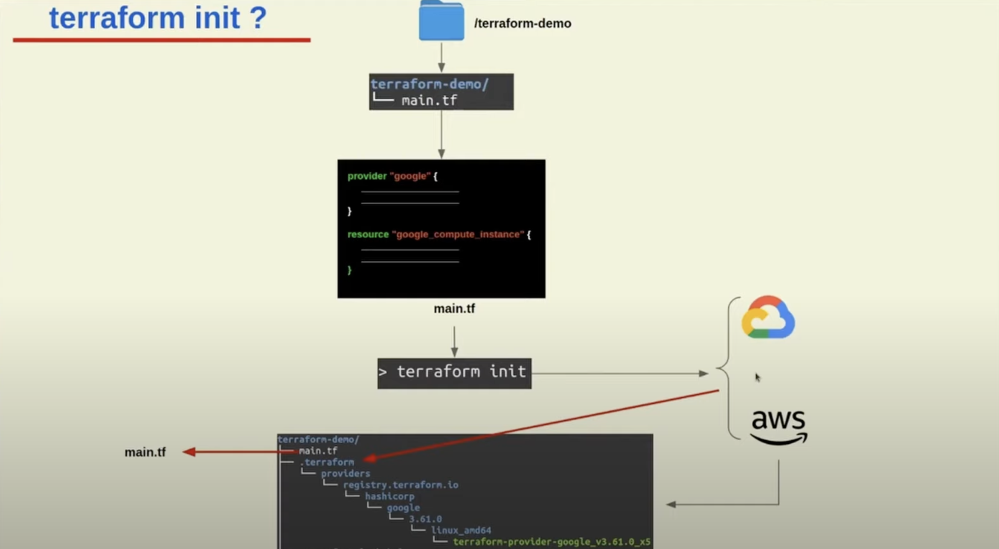
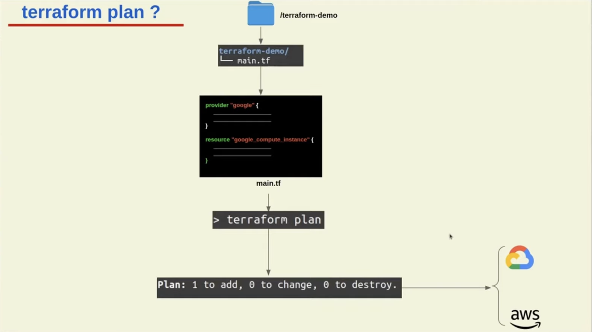
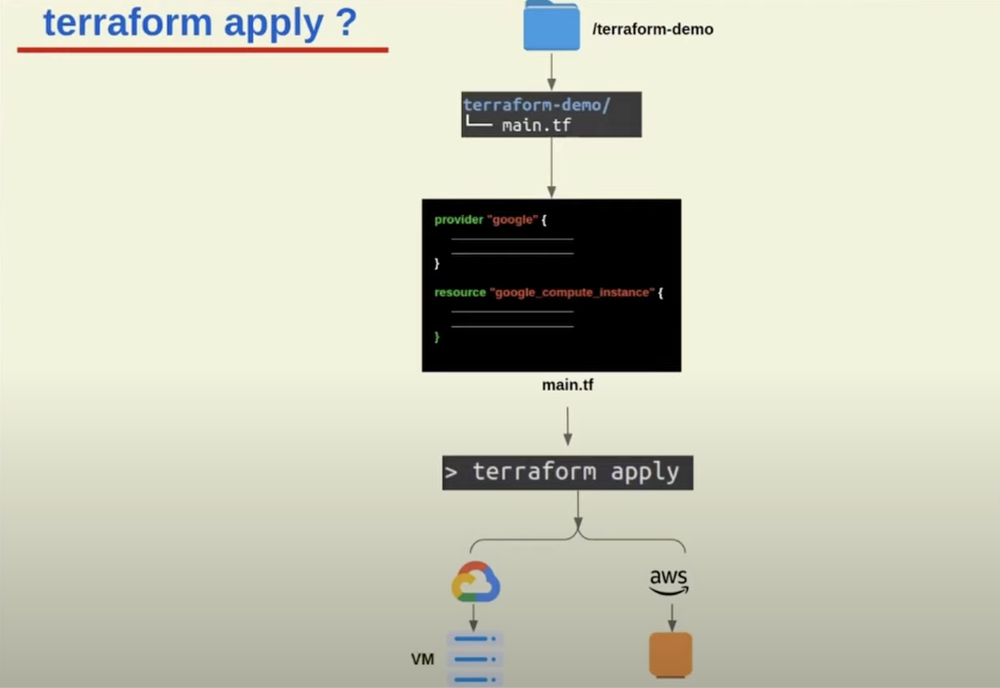

# Terraform Basics

## Terraform lifecycle


## Change Automation

**What is change management?** is the procedure that will be followed when resources are modify and applied via configuration script.

**What is change Automation?** a way of automatically creating consistent, systematic, and predictable way of managing change request via controls and policies.

Terraform uses Change Automation in the form of <mark>Execution Plans</mark> and <mark>Resources graphs</mark> to apply and review complex <mark>changesets</mark>

## Execution plans

Is a manual review of what will add, change or destroy before you apply changes eg. terraform apply. You can visualize an execution plan using the `terraform graph` command. Terraform will output a GraphViz file.

```sh
terraform graph | dot -Tsvg > graph.svg
```

## Terraform Core and Terraform Plugins

- Core: Uses remote procedure calls (RPC) to communicate with Terraform Plugins
- Plugins: expose an implementation for a specific service, or provisioner


## Terraform init

```sh
terraform init
```



## Terraform plan

```sh
terraform plan
```



## Terraform apply

```sh
terraform apply
```


