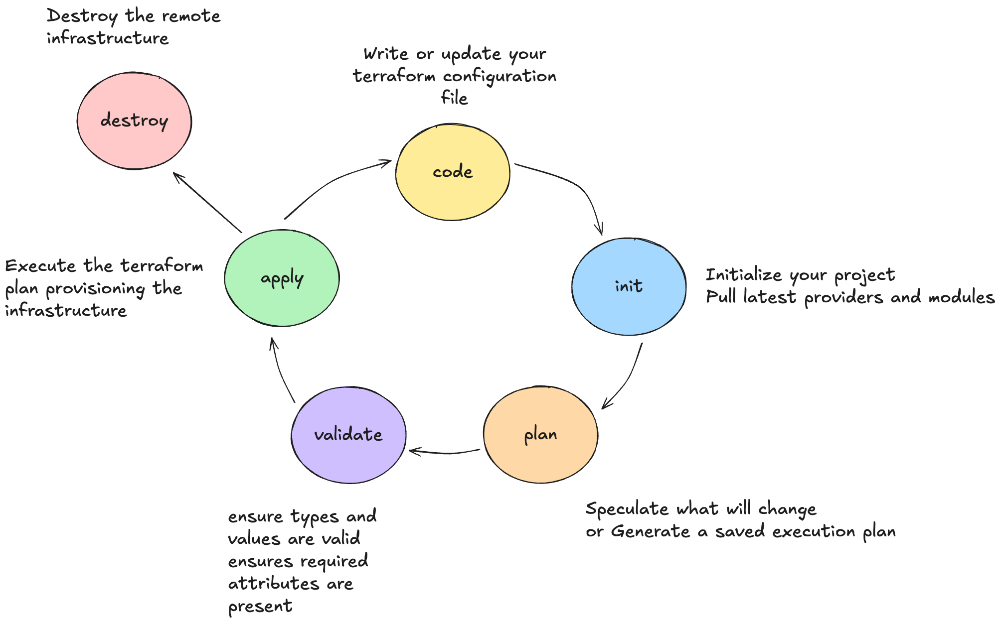
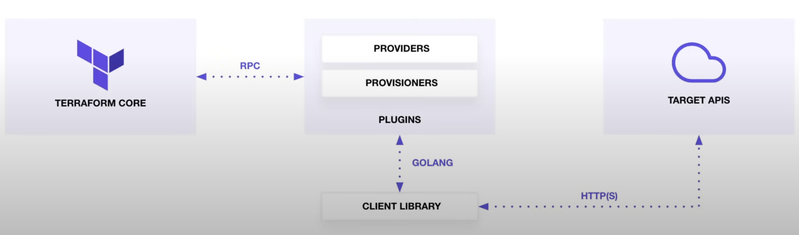
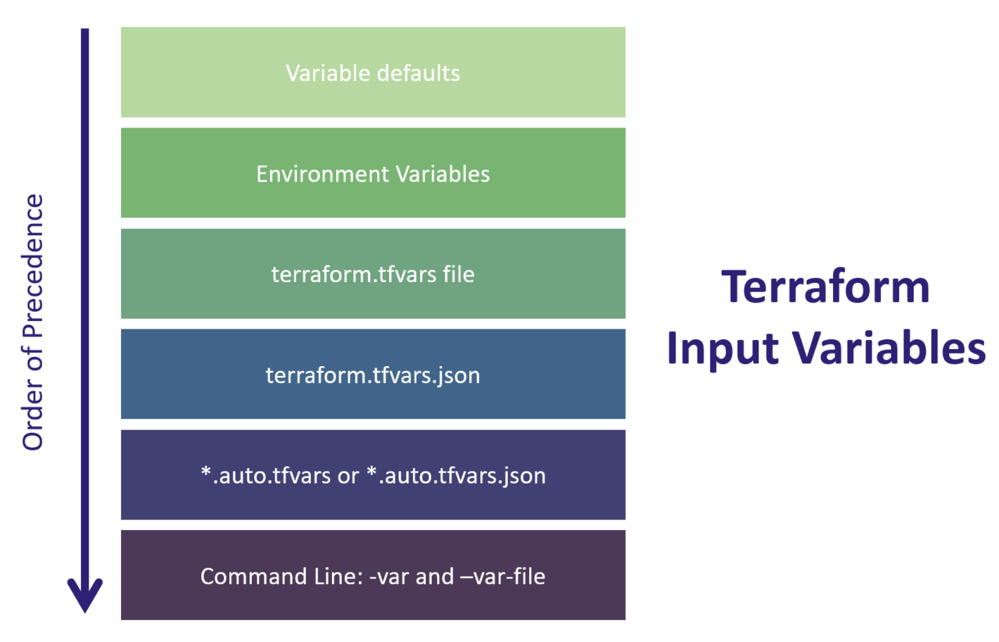

# Terraform Basics

## Terraform lifecycle



## Change Automation

**What is change management?** is the procedure that will be followed when resources are modify and applied via configuration script.

**What is change Automation?** a way of automatically creating consistent, systematic, and predictable way of managing change request via controls and policies.

Terraform uses Change Automation in the form of <mark>Execution Plans</mark> and <mark>Resources graphs</mark> to apply and review complex <mark>changesets</mark>

Is a manual review of what will add, change or destroy before you apply changes eg. terraform apply. 
## Terraform Core and Terraform Plugins

- Core: Uses remote procedure calls (RPC) to communicate with Terraform Plugins
- Plugins: expose an implementation for a specific service, or provisioner



## Terraform syntaxis

### Initializing the directory

Initializing a configuration directory downloads and installs the providers defined in the configuration, which in this case is the `aws` provider.

Terraform downloads the `aws` provider and installs it in a hidden subdirectory of your current working directory, named .terraform. The terraform init command prints out which version of the provider was installed. Terraform also creates a lock file named .terraform.lock.hcl which specifies the exact provider versions used, so that you can control when you want to update the providers used for your project.

### Format and validate the configuration

The terraform fmt command automatically updates configurations in the current directory for readability and consistency.

```sh
terraform fmt
```

You can also make sure your configuration is syntactically valid and internally consistent by using the terraform validate command.

```sh
terraform validate
```

### Terraform Plan

Terraform has a dry run mode where you can preview what Terraform will change without making any actual changes to your infrastructure. This dry run is performed by running a `terraform plan`.

In your terminal, you can run a plan as shown below to see the changes required for Terraform to reach your desired state you defined in your code. This is equivalent to running Terraform in a “dry” mode.

```sh
terraform plan
```

> Note: Terraform also has the concept of planning out changes to a file. This is useful to ensure you only apply what has been planned previously. Try running a plan again but this time passing an -out flag as shown below.

```sh
terraform plan -out myplan
terraform apply myplan
```

This will create a plan file that Terraform can use during an `apply`.

You can visualize an execution plan using the `terraform graph` command. Terraform will output a GraphViz file.

```sh
terraform graph | dot -Tsvg > graph.svg
```

### Create infrastructure

Apply the configuration now with the `terraform apply` command. Terraform will print output similar to what is shown below. We have truncated some of the output to save space.

```sh
terraform apply
```

Before it applies any changes, Terraform prints out the execution plan which describes the actions Terraform will take in order to change your infrastructure to match the configuration.

The output format is similar to the diff format generated by tools such as Git. The output has a `+` next to `aws_instance.app_server`, meaning that Terraform will create this resource. Beneath that, it shows the attributes that will be set. When the value displayed is `(known after apply)`, it means that the value will not be known until the resource is created.

### Inspect state

When you applied your configuration, Terraform wrote data into a file called `terraform.tfstate`. Terraform stores the IDs and properties of the resources it manages in this file, so that it can update or destroy those resources going forward.

The Terraform state file is the only way Terraform can track which resources it manages, and often contains sensitive information, so you must store your state file securely and restrict access to only trusted team members who need to manage your infrastructure.

```sh
terraform show
```

### Benefits of state

During execution, terraform will examine the state of the currently running infrastructure, determine what differences exist between the current state and the revised desired state, and indicate the necessary changes that must be applied. When approved to proceed, only the necessary changes will be applied, leaving existing, valid infrastructure untouched.

### Manually Managing State

Terraform has a built-in command called terraform state for advanced state management. Use the list subcommand to list of the resources in your project's state.

```sh
terraform state list
```

### Destroy

The `terraform destroy` command terminates resources managed by your Terraform project. This command is the inverse of `terraform apply` in that it terminates all the resources specified in your Terraform state. I does *not* destroy resources running elsewhere that are not managed by the current Terraform project.


### Hashicrop configuration language

Terraform is written in HCL (HashiCorp Configuration Language) and is designed to be both human and machine readable. HCL is built using code configuration blocks which typically follow the following syntax:

```terraform
# Template
<BLOCK TYPE> "<BLOCK LABEL>" "<BLOCK LABEL>" {
    # Block body
    <IDENTIFIER> = <EXPRESSION> # Argument
}

# AWS EC2 Example
resource "aws_instance" "web_server" { # BLOCK
    ami = "ami-04d29b6f966df1537" # Argument
    instance_type = var.instance_type # Argument with value as expression (Variable value re
}
```

Terraform Code Configuration block types include:

- Terraform Settings Block
- Terraform Provider Block
- Terraform Resource Block
- Terraform Data Block
- Terraform Input Variables Block
- Terraform Local Variables Block
- Terraform Output Values Block
- Terraform Modules Block


### Terraform Block

The `terraform {}` block conatins Terraform settings, including the required providers. Terraform will use to provision your infrastructure. For each provider, the `source` attribute defines an optional hostname, a namespace, and a provider type

You can also set a version constraint for each provider defined in the required_providers block. The `version` attribute is optional, but we recommend using it to constrain the provider version so that Terraform does not install a version of the provider that does not work with your configuration.

### Provider Block

The `provider` block configures the specified provider, in this case `aws`. A provider is a plugin that Terraform uses to create and manage your resources. You can use multiple provider blocks in your terraform configuration to manage resources from different providers. You can even use different providers together.

### Resource Block

Use `resource` blocks to define components of your infrastructure. A resource might be a physical or virtual component such as an EC2 instance, or it can be a logical resource such as a Heroku application.

Resource blocks have two strings before the block: the resource type and the resource name. Together the resoruce type and name form a unique ID fo the resource.

### Input Variables Block

Input variables (commonly referenced as just ‘variables’) are often declared in a separate file called variables.tf, although this is not required. Most people will consolidate variable declaration in this file for organization and simplification of management. Each variable used in a Terraform configuration must be declared before it can be used.

#### Template

```terraform
variable “<VARIABLE_NAME>” {
    # Block body
    type = <VARIABLE_TYPE>
    description = <DESCRIPTION>
    default = <EXPRESSION>
    sensitive = <BOOLEAN>
    validation = <RULES>
}
```

#### Example

```terraform
variable "aws_region" {
    type = string
    description = "region used to deploy workloads"
    default = "us-east-1"
    validation {
        condition = can(regex("^us-", var.aws_region))
        error_message = "The aws_region value must be a valid region in the
        USA, starting with \"us-\"."
    }
}
```

The value of a Terraform variable can be set multiple ways, including setting a default value, interactively passing a value when executing a terraform plan and apply, using an environment varriable, or setting the value in a `.tfvars` file. Each of these different options follows a strict order of precedence that Terraform uses to set the value of a variable.



### Local Variables Block

Locals are very similar to traditional input variables and can be referred to throughout your Terraform configuration. Locals are often used to give a name to the result of an expression to simplify your code and make it easier to read.

Locals are not set directly by the user/machine executing the Terraform configuration, and the values don’t change between or during the Terraform workflow (`init`, `plan`, `apply`).
