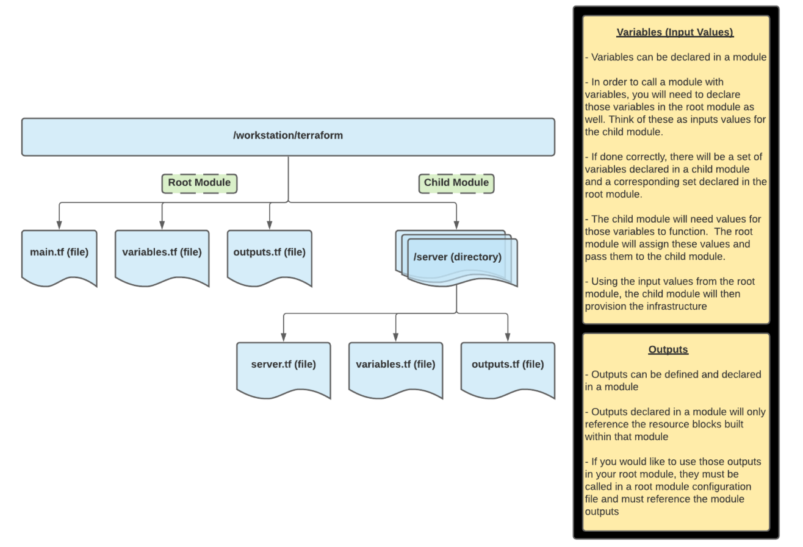

# Terraform Modules

Terraform configuration can be separated out into modules to better organize your configuration. This makes your code easier to read and resuable across your organization. A Terraform module is very simple: any set of Terraform configuration files in a folder is a module. Modules are the key ingredient to writing reusable and maintainable Terraform code. Complex configurations, team projects, and multi-repository codebases will benefit from modules. Get into the habit of using them wherever it makes sense.

## Terraform Modules Inputs and Outputs

To make a Terraform module configurable you can add input parameters to the module. These are defined within the module using input variables. A module can also return values to the configuration that called the module. These module returns or outputs are defined using terraform output blocks.

## Terraform Module Scope

### Scoping Module Inputs and Outputs

Modules are simply terraform configuration files that have optional/required inputs and will return a specifed number of outputs. The configuration within the module can be akin to a black box, as the module is abstracting away the configuration blocks which it contains. The module code for child modules is still typically availabe for us to review if we like, but not required to be able to get resources built out without having to worry about all of the details within the child module.

### Invalid Module References

Module outputs are the only supported way for users to get information about resources configured within the child module. Individual resource arguments are not accessible outside the child module.

### Notes about building Terraform Modules

When building a module, consider three areas:

- **Encapsulation**: Group infrastructure that is always deployed together. Including more infrastructure in a module makes it easier for an end user to deploy that infrastructure but makes the module’s purpose and requirements harder to understand
- **Privileges**: Restrict modules to privilege boundaries. If infrastructure in the module is the responsibility of more than one group, using that module could accidentally violate segregation of duties. Only group resources within privilege boundaries to increase infrastructure segregation and secure your infrastructure
- **Volatility**: Separate long-lived infrastructure from short-lived. For example, database infrastructure is relatively static while teams could deploy application servers multiple times a day. Managing database infrastructure in the same module as application servers exposes infrastructure that stores state to unnecessary churn and risk.
