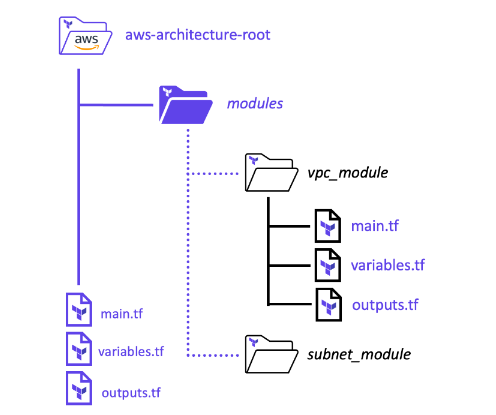

# Terraform Modules

Terraform configuration can be separated out into modules to better organize your configuration. This makes your code easier to read and resuable across your organization. A Terraform module is very simple: any set of Terraform configuration files in a folder is a module. Modules are the key ingredient to writing reusable and maintainable Terraform code. Complex configurations, team projects, and multi-repository codebases will benefit from modules. Get into the habit of using them wherever it makes sense.

## Terraform Modules Inputs and Outputs

To make a Terraform module configurable you can add input parameters to the module. These are defined within the module using input variables. A module can also return values to the configuration that called the module. These module returns or outputs are defined using terraform output blocks.

## Terraform Module Scope
